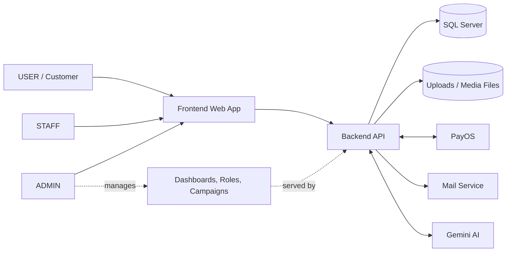
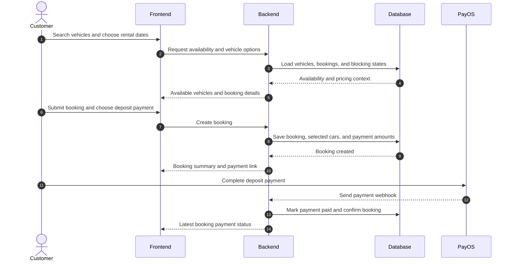
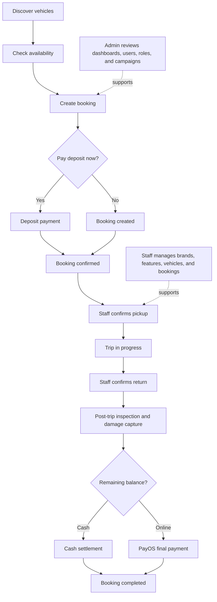

# CarRentalSystem

CarRentalSystem is a full-stack car rental platform, branded in the UI as
EcoDrive, that combines customer booking, staff-operated trip handling, and
admin oversight in one system. The repository includes a web frontend, a
backend API, sample seed data, and booking/trip flows that cover the journey
from vehicle discovery to final settlement.

## What This Project Does

The project supports the day-to-day operations of a modern rental service:

- Customers can browse vehicle options, check availability, create bookings,
  pay deposits, and track booking/payment status.
- Staff can manage fleet records, confirm pickup and return, capture post-trip
  damage, and settle final balances.
- Admin users can manage roles, users, discount campaigns, and dashboard
  visibility over platform activity.

## Why It Was Made

This repository brings the core rental lifecycle into one platform instead of
spreading it across disconnected tools. The goal is to provide a clearer
experience for renters, cleaner handoffs for staff, and better operational
visibility for administrators while keeping the implementation easy to review
on GitHub.

## Who It Is For

### Repository Audiences

| Audience | What they should learn here |
|----------|-----------------------------|
| Reviewer or instructor | What the project does, how the main flows work, and how the system is structured |
| Contributor | How to start the app locally, where the important code lives, and which integrations are optional |
| Product or operations stakeholder | Which roles are supported and how the booking lifecycle is handled end to end |

### Product Roles

| Role | Main responsibility |
|------|---------------------|
| `USER` | Search vehicles, create bookings, and complete payments |
| `STAFF` | Manage operational handoff, return, damage capture, and settlement |
| `ADMIN` | Manage users, custom roles, campaigns, and dashboard reporting |

## Supported Capabilities

### By Audience and Role

| Area | What is supported | Evidence in repo |
|------|-------------------|------------------|
| Vehicle discovery | Public catalog, vehicle details, availability checks, and filtered browsing | `Frontend/src/app/(unauth)/vehicles/`, `Backend/src/main/java/main/controllers/CarTypeController.java` |
| Booking and checkout | Booking creation, deposit calculation, payment status tracking, and booking history | `Frontend/src/app/(auth)/checkout/`, `Backend/src/main/java/main/controllers/BookingController.java`, `Backend/src/main/java/main/controllers/PaymentTransactionController.java` |
| Staff trip operations | Pickup confirmation, return confirmation, post-trip inspections, damage uploads, and final settlement | `Frontend/src/app/(auth)/staff/bookings/`, `Backend/src/main/java/main/controllers/StaffBookingController.java` |
| Admin operations | User management, role management, discount campaigns, and dashboards | `Frontend/src/app/(auth)/admin/`, `Backend/src/main/java/main/controllers/AdminController.java`, `Backend/src/main/java/main/controllers/DashboardController.java`, `Backend/src/main/java/main/controllers/DiscountCampaignAdminController.java` |
| Supporting services | Authentication, notifications, media uploads, payment webhooks, and AI chat recommendations | `Backend/src/main/java/main/controllers/AuthController.java`, `Backend/src/main/java/main/controllers/DiscountNotificationController.java`, `Backend/src/main/java/main/controllers/PayosWebhookController.java`, `Backend/src/main/java/main/controllers/ChatController.java` |

### By Rental Lifecycle

1. Discover vehicles and inspect availability.
2. Create a booking and calculate deposit or remaining balance.
3. Complete an online deposit or keep the booking in a created state.
4. Hand over the vehicle through staff confirmation.
5. Track return, inspection, damage evidence, and overdue charges.
6. Settle the final balance by cash or online payment.
7. Review dashboards, campaigns, users, and roles from admin views.

## Architecture Diagram

This diagram shows the major application parts and the supporting services that
the README setup section refers to.



## Primary Sequence Diagram

This sequence focuses on the booking-and-deposit path that turns vehicle
selection into a confirmed rental.



Source references: [`flow_1_booking_sequence_diagram.puml`](flow_1_booking_sequence_diagram.puml),
[`Backend/src/main/java/main/controllers/BookingController.java`](Backend/src/main/java/main/controllers/BookingController.java),
[`Backend/src/main/java/main/controllers/PaymentTransactionController.java`](Backend/src/main/java/main/controllers/PaymentTransactionController.java)

## Workflow Diagram

This flow summarizes the end-to-end rental lifecycle across customer, staff,
and admin touchpoints.



Source references: [`flow_2_trip_management_sequence_diagram.puml`](flow_2_trip_management_sequence_diagram.puml),
[`Frontend/src/app/(auth)/staff/`](<Frontend/src/app/(auth)/staff/>),
[`Frontend/src/app/(auth)/admin/`](<Frontend/src/app/(auth)/admin/>)

## Local Setup

### 1. Prerequisites

- Java 17
- Maven Wrapper support (`Backend/mvnw` or `Backend/mvnw.cmd`)
- A current Node.js LTS release compatible with the existing frontend
- npm
- SQL Server for the baseline backend flow

### 2. Safe Local Configuration

Use your own local values. Do not copy the live values currently present in the
repository configuration into shared documentation, screenshots, or commits.

#### Backend configuration

Update `Backend/src/main/resources/application.properties` with safe local or
test values for the categories below:

| Category | Property names | Required for baseline run |
|----------|----------------|---------------------------|
| Database | `spring.datasource.url`, `spring.datasource.username`, `spring.datasource.password` | Yes |
| Auth | `security.jwt.secret`, `security.jwt.expiration-ms` | Yes |
| Frontend URL | `app.frontend.base-url` | Yes |
| File uploads | `app.upload.dir`, multipart size settings | Yes |
| Payments | `payos.client-id`, `payos.api-key`, `payos.checksum-key` | Optional for real payment flows |
| Mail | `spring.mail.host`, `spring.mail.username`, `spring.mail.password`, related SMTP settings | Optional for notification delivery |
| AI chat | `gemini.api.key` | Optional for AI recommendation flows |

#### Frontend configuration

Create `Frontend/.env.local` with safe local values:

```bash
NEXT_PUBLIC_APP_URL=http://localhost:3000
NEXT_PUBLIC_SERVER_URL=http://localhost:8080
```

The frontend utility layer already falls back to `http://localhost:3000` and
`http://localhost:8080`, but making the values explicit keeps local setup
clearer for contributors.

### 3. Create the Database

Create a SQL Server database named `ev_rental` before running the seed script or
starting the backend against a fresh environment.

### 4. Load Sample Data

The repository includes a ready-made sample dataset in
[`Backend/sql/seed/seed_all.sql`](Backend/sql/seed/seed_all.sql) and detailed
notes in [`Backend/sql/seed/README.md`](Backend/sql/seed/README.md).

Options:

- Use SQL Server Management Studio or Azure Data Studio to run `seed_all.sql`
- Use `sqlcmd` with your own local credentials, for example:

```bash
sqlcmd -S localhost,1433 -d ev_rental -U <db-user> -P <db-password> -i seed_all.sql
```

### 5. Start the Backend

From `Backend/`:

```bash
./mvnw spring-boot:run
```

Windows PowerShell:

```powershell
.\mvnw.cmd spring-boot:run
```

The backend default port is `8080`, and Swagger UI is exposed at:
`http://localhost:8080/swagger-ui.html`

### 6. Start the Frontend

From `Frontend/`:

```bash
npm install
npm run dev
```

The frontend default URL is `http://localhost:3000`.

### 7. Required vs Optional Integrations

| Integration | Needed for baseline startup? | What it unlocks |
|-------------|------------------------------|-----------------|
| SQL Server | Yes | Core data, bookings, fleet, dashboard-backed flows |
| Frontend app URL and backend API URL | Yes | Frontend-to-backend communication |
| PayOS | No | Online deposit and final-payment flows |
| Mail service | No | Email notifications and delivery workflows |
| Gemini AI | No | AI-powered vehicle recommendation chat |

If you skip the optional integrations, keep obviously fake local placeholders in
your config and avoid validating the related flows end to end.

### 8. Quick Verification

After startup:

1. Open `http://localhost:3000` and confirm public pages load.
2. Open `http://localhost:8080/swagger-ui.html` and confirm the backend is up.
3. Confirm the sample data is visible in catalog, booking, or dashboard-related
   views if you loaded the seed script.

## Repository Orientation

| Path | Why it matters |
|------|----------------|
| [`Frontend/`](Frontend/) | Frontend app, route groups, shared UI, and API service wrappers |
| [`Frontend/FRONTEND_SUMMARY.md`](Frontend/FRONTEND_SUMMARY.md) | Frontend stack and structure overview |
| [`Backend/`](Backend/) | Backend API, services, entities, configs, and tests |
| [`Backend/sql/seed/`](Backend/sql/seed/) | Seed data and environment bootstrapping notes |
| [`flow_1_booking_sequence_diagram.puml`](flow_1_booking_sequence_diagram.puml) | Detailed booking flow reference |
| [`flow_2_trip_management_sequence_diagram.puml`](flow_2_trip_management_sequence_diagram.puml) | Detailed pickup/return/settlement flow reference |
| [`specs/`](specs/) | Feature specs, plans, tasks, and planning history |

## What To Review First

If you are opening this repository for the first time, use this order:

1. Read the overview and supported capabilities.
2. Inspect the architecture and workflow diagrams.
3. Follow the local setup section.
4. Open the repository areas in the orientation table that match your goal.

## Validation Checklist

- The README answers what the project does, why it exists, what it supports,
  who it is for, and how to run it locally.
- The architecture, sequence, and workflow diagrams render directly on GitHub.
- Setup examples use placeholders instead of live credentials.
- Required and optional integrations are clearly separated.
